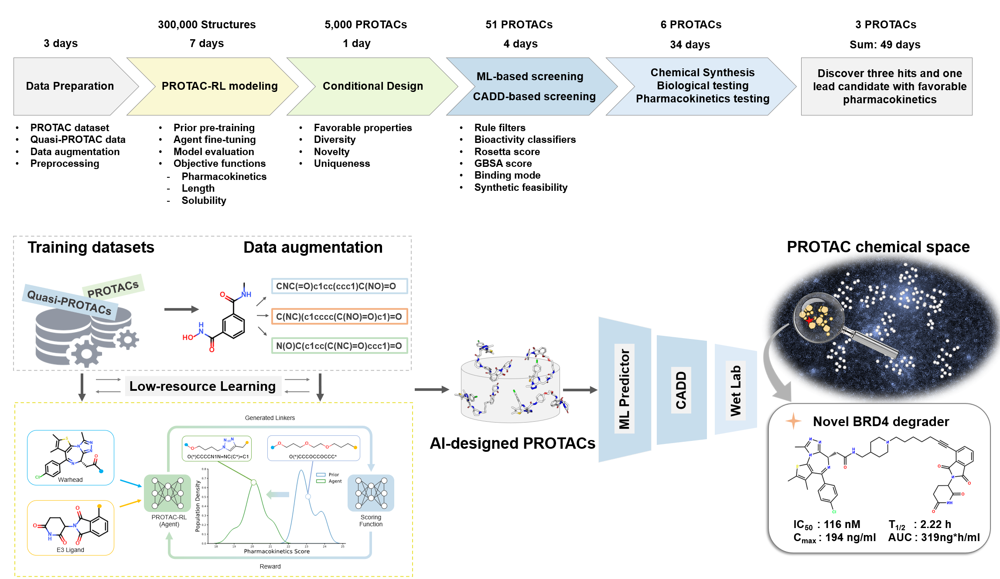

# PROTAC-RL

Source code for the *Nature Machine Intelligence* paper [Accelerated rational PROTAC design via deep learning and molecular simulations](https://www.nature.com/articles/s42256-022-00527-y).




PROTAC-RL is a novel deep reinforcement learning-driven generative model for the rational design of PROTACs in a low-resource setting. 

## Install requirements

Python = 3.6.10

rdkit = 2019.09.2.0, torch = 1.8.0+cu111

Python packages listed in environment.yml

To install all the Python packages, create a new conda environment:

```bash
conda env create -f environment.yml
conda activate PROTAC-RL
```

## Pre-processing 

The tokenized datasets can be found on the `data/` folder. 

`PROTAC`, `ZINC`  are datasets from PROTAC-DB, ZINC (molecular weight > 500). For each dataset, we have two types of SMILES. One is canonical SMILES and another is random SMILES (data augmentation). 

We use a shared vocabulary. The `vocab_size` and `seq_length` are chosen to include the whole datasets.

In order to have the same vocabulary for pre-training and fine-tuning, remember to move `.vocab.pt` from `ZINC` dataset to `PROTAC` dataset after `PROTAC` dataset being pre-processed.


## Pre-training

pre-training can be started by running the `training.sh` script using `ZINC` dataset

## Fine-tuning

fine-tuning script `fine-tune-training.sh` can be run after pre-training using `PROTAC` dataset

## RL (beam search & Multinomial sampling)

To train the RL model use the `train_case.sh` script, training in beam search can use `train_type` as B and in multinomial sampling can use ` train_type` as M. Annotation is sufficient in script file `train_case.sh`.

In most of cases, multinomial sampling performs better because of its ability to explore larger chemical space.

The input of cases can refer to `case/dBET6/`

## Generation (beam search & multinomial sampling)

Model generation of beam search can be started by running the `testing_beam_search_*.sh` script. There are several similar generating files provided by us, and usage of each file was written in annotation in beginning of each file. 

Model generation of multinomial sampling can be started by running the `testing_msearch_*.sh` script. Also, there are several similar generating files provided by us, and usage of each file was written in annotation in beginning of each file. 

## Example

To specifically describe how to train and use our PROTAC-RL, we showed an example below:

pre-processing for ZINC (parameters of script changed to ZINC)

```
bash preprocess.sh
```

then tune parameters to PROTACs

```
bash preprocess.sh
```

before fine-tuning, move `.vocab.pt` from ZINC dataset folder to PROTAC dataset folder and replace orgin one

fine-tuning with PROTAC data

```
bash fine-tuning.sh
```

RL-training in dBET6 case and scoring function was set to PK

```
bash train_case.sh
```

generate from RL-training model

```
bash testing_msearch_case.sh
```

then find generation and log file in dBET6 case folder

## Reference

Please cite the following paper if you use this code in your work.

```
@article{zheng2022accelerated,
  title={Accelerated rational PROTAC design via deep learning and molecular simulations},
  author={Zheng, Shuangjia and Tan, Youhai and Wang, Zhenyu and Li, Chengtao and Zhang, Zhiqing and Sang, Xu and Chen, Hongming and Yang, Yuedong},
  journal={Nature Machine Intelligence},
  pages={1--10},
  year={2022},
  publisher={Nature Publishing Group}
}
```
## Contact
[@Shuangjia](https://prokia.github.io/) 

